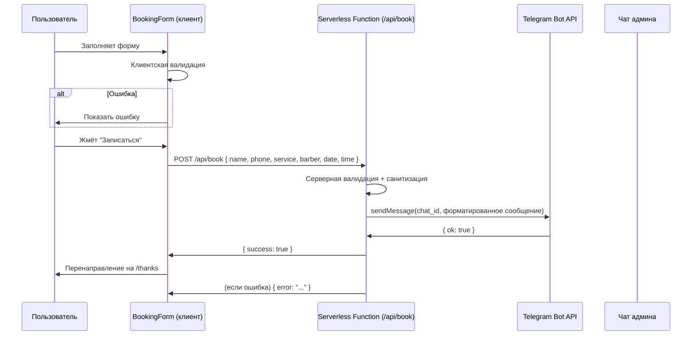
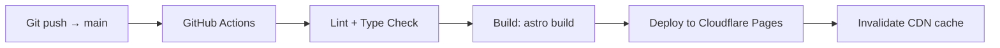

# ARCHITECTURE.md — Vegas Barbershop Website

> **Проект:** Лендинг барбершопа "Vegas", г. Энгельс  
> **Версия:** 1.0  
> **Статус:** Черновик  

---

## 1. Технологический стек

### Frontend

| Слой | Выбор | Обоснование |
|---|---|---|
| **Фреймворк** | **Astro** (SSG-режим) | Статический output без сервера. Лучший PageSpeed из коробки. Zero JS по умолчанию — JS-бандлы только для интерактивных компонентов. Островная архитектура. |
| **Язык** | TypeScript | Строгая типизация, меньше багов в продакшене |
| **CSS** | **Tailwind CSS v4** | Утилитарный CSS, mobile-first из коробки, минимальный бандл за счёт purging |
| **UI-компоненты** | Острова Astro + **Lit** (или **Preact** для минимальных интерактивов) | Лёгкие веб-компоненты для галереи и формы. Preact ~3 KB gzip — альтернатива, если нужен React-подобный DX. |
| **Иконки** | **Lucide** (SVG-иконки через @lucide/astro или inline SVGs) | 1000+ иконок, tree-shakeable |
| **Анимации** | **Intersection Observer** на нативном JS + CSS transitions | Без библиотек — параллакс hero и appear-animations на чистом CSS/JS |

#### Почему Astro, а не Next.js / Nuxt

| | Astro (SSG) | Next.js (SSG) | Nuxt (SSG) |
|---|---|---|---|
| JS на странице | Минимум (острова) | React-бандл, hydration | Vue-бандл, hydration |
| PageSpeed | ⭐ 95–100 | 85–95 | 85–95 |
| Сложность настройки | Низкая | Средняя | Средняя |
| Отправка формы | Telegram API с серверной функцией | API Route | Server route |

Astro даёт максимальную скорость при минимальной сложности — идеально для лендинга.

### Server-side (для формы записи)

| Компонент | Решение | Жильё |
|---|---|---|
| Обработчик формы | **Astro server endpoint** (в режиме SSR для /api/book) или **Cloudflare Function / Netlify Function** | Хостинг (см. раздел 5) |
| Telegram Bot | **grammy** (TypeScript) или raw fetch к Bot API | В той же serverless-функции |
| База данных | **Не нужна** — запись сразу уходит в Telegram | — |

---

## 2. Структура страниц / роутинг

### Одна страница (SPA-лендинг)

```
/                          # Главная — она же весь лендинг
├── #hero                  # Hero section
├── #services              # Услуги и цены
├── #team                  # Команда барберов
├── #gallery               # Галерея работ
├── #contact               # Контакты и карта
└── #booking               # Форма записи
```

Вся навигация — якорная, внутри одной страницы (`/#services`, `/#booking`).

### Дополнительные маршруты

```
/booking                   # Отдельная страница формы (для ссылок из соцсетей/reklama)
/thanks                    # Страница "Спасибо" после отправки формы
/sitemap.xml               # Sitemap (генерируется Astro через @astrojs/sitemap)
/robots.txt                # Robots
```

### Схема организации файлов в Astro

```
src/
├── pages/
│   ├── index.astro            # Главный лендинг
│   ├── booking.astro          # Отдельная страница формы
│   ├── thanks.astro           # Страница "Спасибо"
│   └── robots.txt.ts          # Генерация robots.txt
├── components/
│   ├── hero/
│   │   ├── Hero.astro
│   │   └── HeroParallax.ts    # Параллакс эффект
│   ├── services/
│   │   ├── Services.astro
│   │   ├── ServiceCard.astro
│   │   └── services.data.ts   # Данные услуг
│   ├── team/
│   │   ├── Team.astro
│   │   ├── BarberCard.astro
│   │   └── team.data.ts
│   ├── gallery/
│   │   ├── Gallery.astro
│   │   ├── GalleryGrid.astro
│   │   └── GalleryLightbox.ts # Client-only lightbox
│   ├── contact/
│   │   ├── Contact.astro
│   │   └── Map.astro          # Яндекс.Карты iframe или API
│   ├── booking/
│   │   ├── Booking.astro
│   │   ├── BookingForm.astro  # Форма записи (client:load)
│   │   └── booking.api.ts     # API endpoint для отправки
│   ├── layout/
│   │   ├── BaseLayout.astro   # <head>, SEO, теги
│   │   └── Header.astro       # Навигация
│   │   └── Footer.astro
│   └── ui/
│       ├── Button.astro
│       ├── Input.astro
│       └── Modal.astro
├── hooks/
│   └── useScrollReveal.ts     # Intersection Observer для анимаций
├── lib/
│   ├── telegram.ts            # Telegram Bot API клиент
│   ├── validation.ts          # Валидация формы
│   └── schema.ts              # Schema.org генерация
├── assets/
│   ├── images/
│   │   ├── hero.webp
│   │   ├── hero-preview.webp  # tiny placeholder
│   │   ├── team/              # Фото барберов
│   │   └── gallery/           # Работы
│   └── fonts/                 # Локальные веб-шрифты
├── styles/
│   └── global.css             # Tailwind + глобальные стили
└── env.d.ts
```

---

## 3. Компонентная архитектура

### Принципы

1. **Astro-компоненты** — всё, что можно отрендерить на сервере. Нулевой JS-бандл.
2. **Client-компоненты** — только то, что требует интерактивности:
   - Форма записи (`client:load`) — валидация, отправка, обратная связь
   - Галерея / лайтбокс (`client:visible`) — загружается, когда секция видна
   - Параллакс hero (`client:visible`)
3. **data.ts-файлы** — отделяем данные от компонентов. Услуги, барберы, цены — редактируются в JSON/TS без трогания шаблонов.

### Диаграмма компонентов

```mermaid
graph TD
    A[BaseLayout] --> B[Header]
    A --> C[Hero]
    A --> D[Services]
    A --> E[Team]
    A --> F[Gallery]
    A --> G[Contact]
    A --> H[Booking]
    A --> I[Footer]

    C --> C1[HeroParallax.client]
    D --> D1[ServiceCard] x N
    E --> E1[BarberCard] x N
    F --> F1[GalleryGrid]
    F1 --> F2[GalleryLightbox.client]
    G --> G1[Map]
    H --> H1[BookingForm.client]
    H1 --> H2[Input]
    H1 --> H2[Button]

    style C1 fill:#f9f,stroke:#333,stroke-width:2px
    style F2 fill:#f9f,stroke:#333,stroke-width:2px
    style H1 fill:#f9f,stroke:#333,stroke-width:2px
```

Розовым — клиентские компоненты (JS-бандл). Остальное — чистый HTML от Astro.

### Компонентная декомпозиция

#### Hero
- Фулскрин-секция с фоновым изображением (WebP)
- IntersectionObserver для параллакса (движение фона при скролле)
- CTA → `/#booking`
- Название со glow-эффектом

#### Services
- 3-колоночная сетка (десктоп) → 2 колонки (планшет) → 1 колонка (мобильный)
- Иконки Lucide inline
- Популярные услуги помечены бейджем "🔥 Хит"

#### Team
- Горизонтальный скролл на мобильных (с touch-поддержкой)
- Сетка на десктопе
- Анимация появления при скролле (IntersectionObserver, CSS keyframes)

#### Gallery
- Masonry layout (CSS columns + break-inside: avoid)
- Лайтбокс на Preact / нативном JS — переключение стрелками / свайпом
- Фильтр по кнопкам (все, стрижки, борода, окрашивание)

#### Contact
- Яндекс.Карты (iframe) — статическая карта с меткой
- Контакты кликабельны: `tel:`, `mailto:`, ссылки на соцсети
- Часы работы в таблице

#### Booking
- Форма: имя, телефон, услуга (select), барбер (select), дата, время
- Валидация на клиенте и на сервере
- Отправка → Telegram
- После отправки: re-route на `/thanks` или показать попап "Спасибо"

---

## 4. Форма записи — Telegram Bot API

### Схема работы



### Telegram Bot — детали реализации

**Создание бота:** через `@BotFather` → получаем `BOT_TOKEN`.

**Формат сообщения в Telegram админу:**
```
✂️ Новая запись

👤 Имя: Иван Петров
📞 Телефон: +7 (927) 123-45-67
💇‍♂️ Услуга: Мужская стрижка
🧔 Барбер: Алексей
📅 Дата: 15.05.2026
🕐 Время: 14:00
```

**Endpoint:**

```typescript
// src/lib/telegram.ts
const BOT_TOKEN = import.meta.env.TELEGRAM_BOT_TOKEN;
const CHAT_ID = import.meta.env.TELEGRAM_CHAT_ID;

export async function sendBookingNotification(data: BookingData) {
  const message = formatBookingMessage(data);
  
  const res = await fetch(
    `https://api.telegram.org/bot${BOT_TOKEN}/sendMessage`,
    {
      method: 'POST',
      headers: { 'Content-Type': 'application/json' },
      body: JSON.stringify({
        chat_id: CHAT_ID,
        text: message,
        parse_mode: 'HTML',
        disable_web_page_preview: true,
      }),
    }
  );

  const result = await res.json();
  if (!result.ok) throw new Error(`Telegram API error: ${result.description}`);
  return result;
}
```

**Обработка ошибок:**
- Retry 3 раза при network error (с exponential backoff)
- Fallback: запись в лог / отправка на email, если Telegram недоступен

**Безопасность:**
- BOT_TOKEN и CHAT_ID — в ENV-переменных, не в коде
- CORS-заголовки: разрешить только origin сайта
- Rate limiting: не более 5 запросов с одного IP за 60 секунд (in-memory на уровне serverless)
- CSRF-токен: опционально (статический, вшит в HTML-шаблон)

### Валидация полей

| Поле | Ограничения |
|---|---|
| Имя | 2–50 символов, без цифр |
| Телефон | +7 (10 цифр), маска ввода |
| Услуга | Из предзаданного списка |
| Барбер | Из предзаданного списка ("Любой" включён) |
| Дата | Не раньше сегодня, не дальше +30 дней |
| Время | 09:00–20:00, шаг 30 минут |

---

## 5. Деплой-стратегия

### Рекомендация: Static Hosting (Cloudflare Pages) ✅

**Почему Cloudflare Pages, а не Vercel / Netlify:**

| Критерий | Cloudflare Pages | Vercel | Netlify |
|---|---|---|---|
| Бесплатный лимит | 500 builds/мес, неогр. bandwidth | 100 GB bandwidth | 100 GB bandwidth |
| Serverless функции | Есть (Cloudflare Workers) | Есть | Есть |
| Глобальный CDN | 330+ городов (крайне быстро в РФ) | 100+ (хуже в РФ) | 100+ (хуже в РФ) |
| Адаптер Astro | @astrojs/cloudflare | @astrojs/vercel | @astrojs/netlify |
| Форма (отправка) | Workers — бесплатно, 100k запросов/день | Serverless Functions (Hobby 100h/мес) | Forms (300 форм/мес бесплатно) |

**Cloudflare Pages** — лучший выбор для РФ: быстрый CDN в России, generous бесплатный лимит, встроенные Workers для API-формы.

### CI/CD Pipeline



**Файл конфигурации:**

```yaml
# .github/workflows/deploy.yml
name: Deploy
on:
  push:
    branches: [main]
jobs:
  deploy:
    runs-on: ubuntu-latest
    steps:
      - uses: actions/checkout@v4
      - uses: actions/setup-node@v4
        with:
          node-version: 22
      - run: npm ci
      - run: npm run build
      - uses: cloudflare/wrangler-action@v3
        with:
          apiToken: ${{ secrets.CF_API_TOKEN }}
          command: pages deploy dist/ --project-name=vegas-barbershop
```

### Альтернатива: Docker + VPS

Если клиент хочет полный контроль:

```
Dockerfile →
  - Stage 1: Node 22, npm ci, npm run build
  - Stage 2: nginx:alpine, копируем dist/
  - Отдаём статику через nginx + ssl (Let's Encrypt / acme.sh)
```

VPS: минимальный Hetzner CX22 (€3.99/мес) или любой российский хостинг.

**Проконсультироваться с клиентом:** статический хостинг проще и дешевле. Docker имеет смысл, если планируется:
- Свой бэкенд (не serverless)
- БД
- Сложные фоновые задачи

---

## 6. Работа с изображениями

### Форматы

| Тип | Исходный формат | В продакшене | Размер |
|---|---|---|---|
| Hero | JPG/PNG | **WebP** + **AVIF** (fallback) | 1920×1080 |
| Фото барберов | JPG/PNG | **WebP** | 600×800 |
| Работы в галерее | JPG/PNG | **WebP** | 1200×наибольшая сторона |
| Иконки | — | **SVG** (inline или Lucide) | — |

### Пайплайн оптимизации

**Локально (при сборке):**
- `@astrojs/image` (built-in Image component) + Sharp
- Команда `astro build` автоматически конвертирует и оптимизирует

**Или ручной pre-build скрипт:**

```bash
# Сконвертировать все JPG → WebP
for f in src/assets/images/**/*.jpg; do
  cwebp -q 80 "$f" -o "${f%.jpg}.webp"
done

# Создать blur placeholder для ленивой загрузки
for f in src/assets/images/gallery/*.webp; do
  ffmpeg -i "$f" -vf "scale=20:-1" "${f%.webp}-tiny.webp"
done
```

### Lazy Loading

```astro
<!-- Astro Image component — WebP + AVIF + lazy load -->
<Image
  src={import('../assets/images/gallery/work-01.jpg')}
  alt="Стрижка"
  loading="lazy"
  decoding="async"
  widths={[400, 800, 1200]}
  sizes="(max-width: 768px) 100vw, 50vw"
  format="webp"
/>
```

### Стратегия для галереи

1. Все изображения — WebP, ~80% quality
2. Thumbnails: 400px ширина (desktop gallery grid)
3. Full-size: 1200px ширина (lightbox)
4. LQIP (Low Quality Image Placeholder): blur placeholder из tiny-webp (20px)
5. IntersectionObserver: загружаем изображения при входе в viewport
6. layout-shift: явно задаём aspect-ratio для всех 

---

## 7. SEO-стратегия

### Meta-теги (в BaseLayout.astro)

```astro
<head>
  <title>VEGAS Барбершоп — Энгельс | Стрижки, бритьё, уход</title>
  <meta name="description" content="Барбершоп Vegas в Энгельсе. Мужские стрижки, бритьё, уход за бородой. Запись онлайн." />
  <meta property="og:title" content="VEGAS Барбершоп — Энгельс" />
  <meta property="og:description" content="Мужские стрижки, бритьё, уход за бородой. Запись онлайн." />
  <meta property="og:type" content="website" />
  <meta property="og:image" content="/og-image.jpg" />
  <meta property="og:locale" content="ru_RU" />
  <meta name="twitter:card" content="summary_large_image" />
  <link rel="canonical" href="https://vegas-barbershop.ru/" />
</head>
```

### Schema.org — LocalBusiness

```json
{
  "@context": "https://schema.org",
  "@type": "LocalBusiness",
  "name": "VEGAS Барбершоп",
  "description": "Мужские стрижки, бритьё и уход за бородой в Энгельсе",
  "url": "https://vegas-barbershop.ru",
  "telephone": "+7 (XXX) XXX-XX-XX",
  "email": "info@vegas-barbershop.ru",
  "address": {
    "@type": "PostalAddress",
    "addressLocality": "Энгельс",
    "addressRegion": "Саратовская область",
    "streetAddress": "ул. Примерная, д. X",
    "addressCountry": "RU"
  },
  "openingHoursSpecification": [
    {
      "@type": "OpeningHoursSpecification",
      "dayOfWeek": ["Monday","Tuesday","Wednesday","Thursday","Friday","Saturday"],
      "opens": "09:00",
      "closes": "20:00"
    },
    {
      "@type": "OpeningHoursSpecification",
      "dayOfWeek": "Sunday",
      "opens": "10:00",
      "closes": "18:00"
    }
  ],
  "priceRange": "₽₽",
  "image": "https://vegas-barbershop.ru/images/hero.webp",
  "sameAs": [
    "https://vk.com/vegasbarbershop",
    "https://instagram.com/vegas.barbershop"
  ]
}
```

### SEO-чеклист

- [x] Канонический URL (canonical)
- [x] Open Graph / Twitter Cards
- [x] Schema.org LocalBusiness + OpeningHoursSpecification
- [x] Sitemap.xml (автогенерация через `@astrojs/sitemap`)
- [x] Robots.txt
- [x] Semantic HTML: `<nav>`, `<section>`, `<article>`, `<h1>-<h3>`
- [x] Атрибуты `alt` на всех изображениях
- [x] Язык: `lang="ru"`
- [x] PageSpeed: 90+ (Astro SSG + оптимизированные изображения)
- [x] LCP < 2.5s (CDN + WebP + предзагрузка hero-изображения)
- [x] CLS < 0.1 (явные aspect-ratio на изображения)
- [x] Адаптация под Яндекс.Вебмастер

---

## Итоговая оценка сложности

| Компонент | Стори-пойнты | Зависимости |
|---|---|---|
| Инициализация проекта (Astro + Tailwind + деплой) | 2 | — |
| STORY-001: Hero section | 3 | Инициализация |
| STORY-002: Services & Pricing | 3 | — |
| STORY-003: Barbers Team | 3 | — |
| STORY-004: Gallery | 5 | Изображения |
| STORY-005: Contact & Map | 2 | API ключ карт |
| STORY-006: Booking form + Telegram | 5 | Telegram Bot |
| STORY-007: Mobile optimization | 3 | Все секции |
| STORY-008: SEO & Meta | 2 | — |
| **Итого** | **28 SP** | |

### Риски и открытые вопросы

1. **Яндекс.Карты** — нужен API-ключ. Если карта в iframe — ключ не требуется, но настраивается метка. **Решение:** iframe-вставка с меткой.
2. **Telegram Bot** — работает только когда серверная функция доступна. На бесплатном Cloudflare Workers — лимит 100k запросов/день, что с запасом.
3. **Изображения для галереи** — нужны исходники от барбершопа. Разрешение хотя бы 1200px по длинной стороне.
4. **Домен** — нужно зарегистрировать (например, vegas-barbershop.ru). Настроить DNS на Cloudflare.
5. **Счётчик для формы** — если нужно отслеживать конверсии, добавить Яндекс.Метрику.
6. **Hosting location** — обсудить с клиентом: хостинг в РФ или глобальный CDN. Яндекс.Карты быстрее работают на российских хостингах.

### API Cost Estimate

| Сервис | Бесплатный лимит | Ожидаемая нагрузка | Месячная стоимость |
|---|---|---|---|
| Telegram Bot API | Безлимит | ~300 записей/мес | 0 ₽ |
| Cloudflare Pages | 500 builds / неогр. bandwidth | 1–5 builds/мес | 0 ₽ |
| Яндекс.Карты (iframe) | Бесплатно | — | 0 ₽ |
| Домен .ru | — | — | ~200–300 ₽/год |

**Итого: ~200–300 ₽/год (только домен).**

---

## DECISIONS.md update

Следующие архитектурные решения требуется записать в `DECISIONS.md` (создать при необходимости):

| # | Решение |
|---|---|
| ADR-001 | Astro SSG для статического лендинга |
| ADR-002 | Tailwind CSS — единственный CSS-фреймворк |
| ADR-003 | Telegram Bot API как единственный канал уведомлений (без БД) |
| ADR-004 | Cloudflare Pages — первичный хостинг (альтернатива: Docker+VPS) |
| ADR-005 | Галерея на нативном JS (без React/Vue) |
| ADR-006 | Формат WebP для всех изображений |
